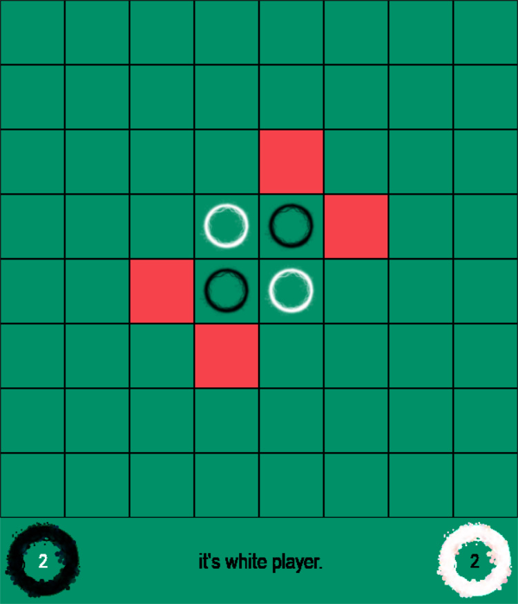
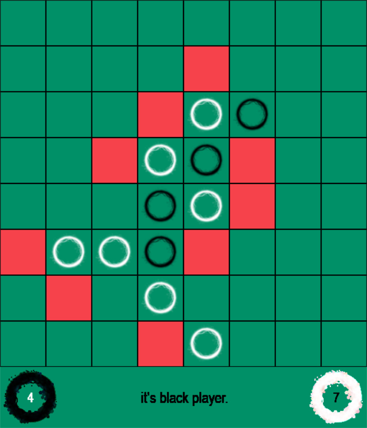
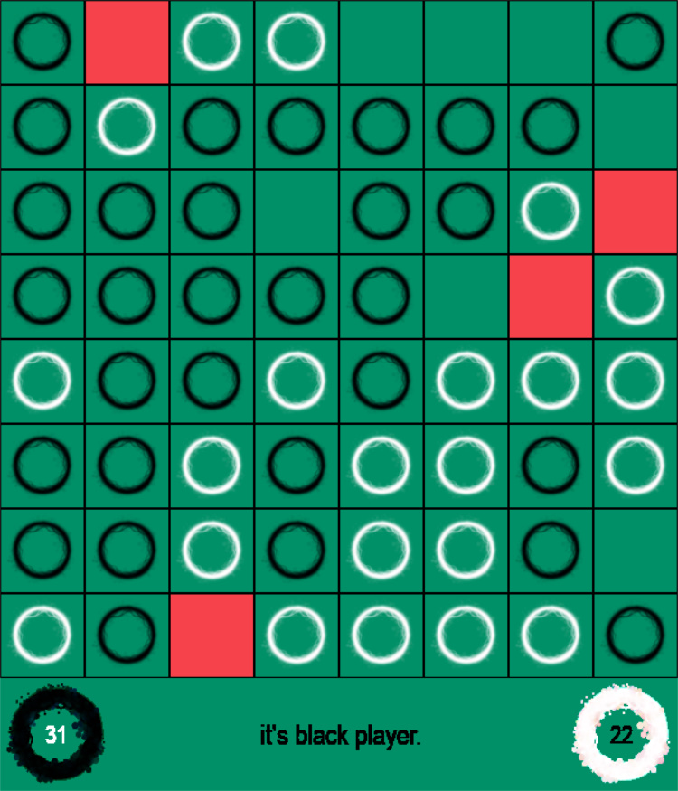

# 🎮 Othello

_Othello is a tragedy written by William Shakespeare, probably in 1603, set in the contemporary Ottoman–Venetian War fought for the control of the Island of Cyprus, a possession of the Venetian Republic since 1489. The port city of Famagusta finally fell to the Ottomans in 1571 after a protracted siege. This Othello game is made by pygame._

<br>

# 🚀 Starting

_These instructions allow you to get a copy of the running project on your local machine._

## 📋 Pre-requisites
_You need to have a 3.X version of Python_

## 🔧 Installation

- Make a git clone or download it in zip
    ```bash
    git clone https://github.com/irania9O/Othello.git
    ```

- Get in the directory
    ```bash
    cd Othello
    ```
<br>

# 🧮 Run game

```bash
python main.py
```

<br>


# 🖼️ Screenshots
<br>

<p float="left">
  
   
</p>
<p float="left">
  
   
</p>